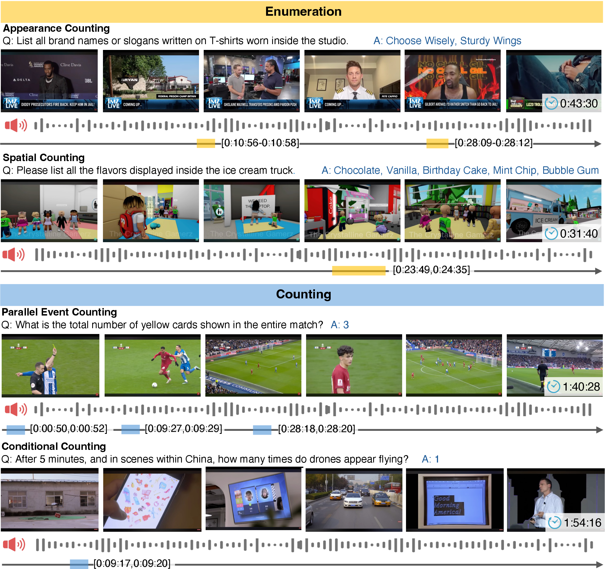
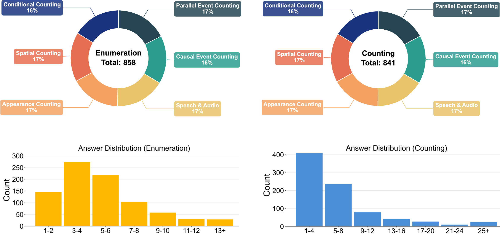
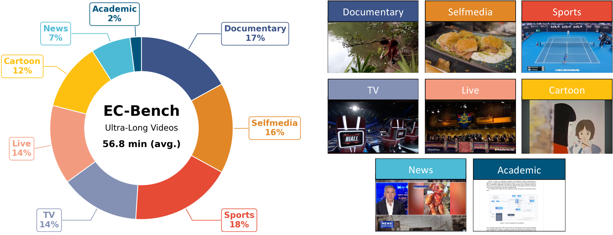
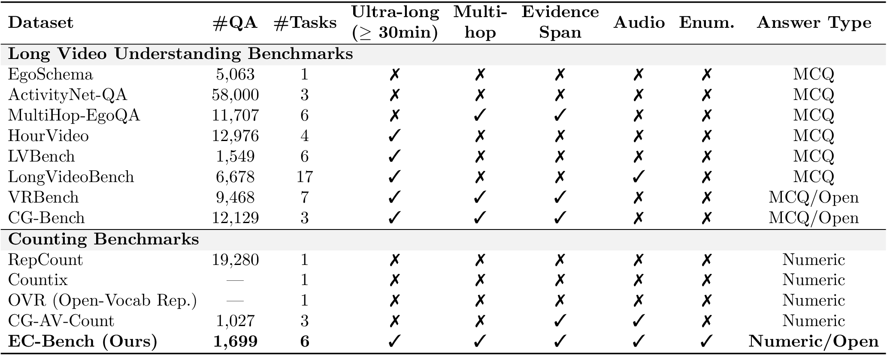
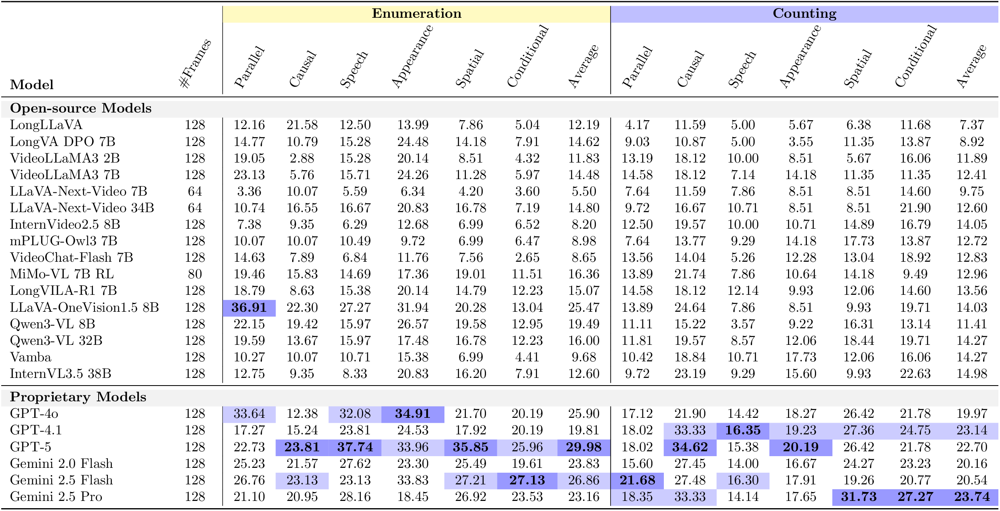
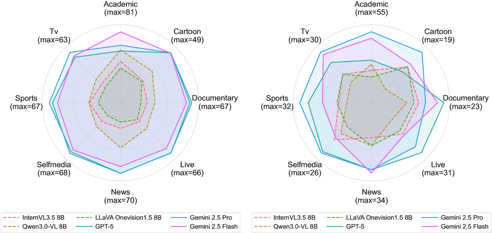

# EC-Bench: Enumeration and Counting Benchmark for Ultra-Long Videos


<div align='center'>

[\[arXiv Paper\]](https://arxiv.org/abs/2603.29943) &nbsp;&nbsp;
[\[Dataset\]](https://huggingface.co/datasets/vai-org/EC-Bench)

</div>

<p align="center">
    
</p>

**EC-Bench** is the first benchmark that jointly evaluates **enumeration**, **counting**, and **temporal evidence grounding** in ultra-long videos. It contains 152 untrimmed videos longer than 30 minutes and 1,699 queries annotated with explicit temporal evidence intervals, enabling precise assessment of what models count and why.

---

## News

- **`2026.03`** EC-Bench is released.

## Introduction

Counting in long videos remains a fundamental yet underexplored challenge in computer vision. Existing counting studies focus on short clips and evaluate only the final number, providing no assessment of *what* should be counted or whether models track objects consistently over extended durations.

EC-Bench addresses this gap by jointly evaluating three closely related abilities: identifying the correct set of events (**enumeration**), determining their temporal spans (**grounding**), and producing a consistent numerical answer (**counting**).

### Key Findings

- The strongest proprietary model achieves only **26.44% counting accuracy**, while human performance reaches **85%**.
- Enumeration accuracy, temporal span correctness, and counting performance are deeply intertwined.
- An **enumeration-first prompting** strategy consistently improves counting accuracy.
- **Denser frame sampling** provides further gains.

### Features

1. **Joint Evaluation**: First benchmark to jointly evaluate enumeration, counting, and temporal evidence grounding in untrimmed long videos.
2. **Ultra-Long Videos**: 152 videos exceeding 30 minutes (median 47 minutes), averaging five times longer than existing datasets.
3. **Large-Scale Queries**: 1,699 free-response queries with carefully aligned evidence intervals spanning six reasoning categories.
4. **Six Reasoning Categories**: Parallel Events, Causal Events, Speech/Audio, Appearance, Spatial, and Conditional counting.
5. **Cross-Modal**: Incorporates both visual and audio information for comprehensive evaluation.

<!-- <p align="center">
    
</p> -->

<p align="center">
    
</p>


## Dataset


### Dataset Statistics


<!-- <p align="center">
    
</p> -->

<p align="center">
    
</p>

### Download

The dataset is hosted on [Hugging Face](https://huggingface.co/datasets/vai-org/EC-Bench):

```python
import datasets
dataset = datasets.load_dataset("vai-org/EC-Bench")
```

## Project Structure

```
ECBench/
├── run_model.py              # Inference entry point for open-source models
├── reshape_output.py          # Post-processing: reshape VLM outputs into evaluation format
├── eval.sh / _eval.sh         # Shell scripts to run the full open-source pipeline
├── config/                    # Model configuration files (YAML)
│   └── Qwen3VL_8B.yaml
├── models/                    # Open-source model wrappers
│   ├── Qwen3VL.py             # Qwen3-VL inference wrapper
│   ├── Qwen3VL_for_reshape.py # Qwen3-VL wrapper for output reshaping
│   └── utils/
│       └── utils.py
├── prompts/                   # Prompt templates
│   ├── Qwen3VL_8B.txt         # Inference prompt (with temporal grounding)
│   └── reshape.txt            # Output reshaping prompt
├── close_models/              # Pipeline for proprietary models (GPT-5, Gemini)
│   ├── inference/
│   │   ├── generate_queries.py    # Query generation via Gemini 2.5 Pro
│   │   ├── generate_answers.py    # Answer generation via GPT-5 / Gemini
│   │   ├── prompts.py             # Inference prompt templates
│   │   ├── query_prompts.py       # Query generation prompt templates
│   │   └── utils.py               # Shared utilities (frame sampling, Whisper, download)
│   ├── evaluation/
│   │   ├── evaluate.py            # Unified LLM-as-a-Judge evaluation CLI
│   │   ├── judge_core.py          # Core evaluation logic (Counting/Enumeration/IoU)
│   │   ├── prompts.py             # Judge prompt templates
│   │   └── dataset.csv            # Ground-truth dataset for evaluation
│   └── data/
│       ├── dataset.csv            # Input dataset
│       └── transcript.csv         # Cached audio transcriptions
├── assets/
│   ├── images/                # Figures for README
│   └── Dockerfile             # Docker environment setup
├── requirements.txt           # Python dependencies
└── data/
    └── video_list/            # Local video files (*.mp4, gitignored)
```

## Installation

### Requirements

- Python 3.11
- CUDA 12.8+
- ffmpeg 7.1+

### Dependencies

```bash
pip install -r requirements.txt
```

### Environment Variables

Create a `.env` file in the project root:

```bash
# Required for proprietary model inference & evaluation
OPENAI_API_KEY=your-openai-api-key

# Required for Gemini inference & query generation
VERTEX_PROJECT_ID=your-gcp-project-id
VERTEX_REGION=global
GCS_BUCKET=your-gcs-bucket
```

## Usage

### 1. Open-Source Model Inference (e.g., Qwen3-VL)

Edit `eval.sh` line 3 to set `project_dir` to your local ECBench path, then run:

```bash
bash eval.sh config/Qwen3VL_8B.yaml experiment_name
```

This executes the full pipeline:
1. **Inference** (`run_model.py`): Loads the model specified in the YAML config, runs QA on each video, and saves raw outputs to `result/<config_name>-<experiment_name>/vlm_output.json`.
2. **Reshaping** (`reshape_output.py`): Post-processes the raw answers into a standardized evaluation format and saves to `reshaped_output.json`.

**Options:**
- `--deepspeed`: Enable DeepSpeed tensor parallelism.
- `--num_gpus=N`: Specify the number of GPUs (default: 1).

```bash
bash eval.sh config/Qwen3VL_8B.yaml experiment_name --deepspeed --num_gpus=4
```

#### Adding a New Model

1. Create a model wrapper in `models/` implementing a `qa(question, video_path)` method that returns `{"answer": str, "clip": list}`.
2. Create a prompt template in `prompts/`.
3. Create a YAML config in `config/` specifying `model_name`, `module_name`, `prompt_path`, and other parameters.

### 2. Proprietary Model Inference (GPT-5, Gemini)

```bash
cd close_models

# Generate answers using Gemini (default)
python -m inference.generate_answers \
    --model_type gemini \
    --frame_count 128 \
    --include_timestamps true \
    --include_transcription true

# Generate answers using GPT-5
python -m inference.generate_answers \
    --model_type openai \
    --frame_count 128

# Batch mode (all queries in one API call per video)
python -m inference.generate_answers \
    --model_type gemini \
    --batch

# FPS-based sampling mode
python -m inference.generate_answers \
    --frame_count 1 \
    --is_fps_mode true
```

### 3. Evaluation (LLM-as-a-Judge)

```bash
cd close_models

# Evaluate a single answer column
python -m evaluation.evaluate \
    --input path/to/results.csv \
    --answer-column gemini_A

# Auto-detect all *_A columns and evaluate
python -m evaluation.evaluate \
    --input path/to/results.csv

# Skip ground-truth merge (if answers CSV already contains GT)
python -m evaluation.evaluate \
    --input path/to/results.csv \
    --no-gt-merge

# Limit rows for quick testing
python -m evaluation.evaluate \
    --input path/to/results.csv \
    --q-num 50
```

The evaluation produces:
- **`*_judge_detail.csv`**: Per-query results (Counting match, Enumeration precision/recall/F1, clip IoU).
- **`*_judge_summary.csv`**: Aggregated metrics (accuracy per reasoning category, MAE, RMSE, mIoU).

## Pipeline Overview

```
                        ┌─────────────────────────────────┐
                        │     Open-Source Models           │
                        │  (Qwen3-VL, etc.)               │
                        ├─────────────────────────────────┤
  HuggingFace Dataset   │                                 │
  (vai-org/EC-Bench) ──►│  run_model.py                   │
         +              │       ↓                         │
  Local Videos          │  vlm_output.json                │
  (data/video_list/)    │       ↓                         │
                        │  reshape_output.py              │
                        │       ↓                         │
                        │  reshaped_output.json           │
                        └─────────────────────────────────┘

                        ┌─────────────────────────────────┐
                        │     Proprietary Models           │
                        │  (GPT-5, Gemini 2.5)            │
                        ├─────────────────────────────────┤
  close_models/         │                                 │
  data/dataset.csv ────►│  inference/generate_answers.py  │
         +              │       ↓                         │
  YouTube Videos        │  Answer CSVs                    │
  (auto-downloaded)     │       ↓                         │
                        │  evaluation/evaluate.py         │
                        │       ↓                         │
                        │  judge_detail.csv               │
                        │  judge_summary.csv              │
                        └─────────────────────────────────┘
```

## Results

### Benchmark Comparison

<p align="center">
    
</p>

### Main Results

Performance of open-source and proprietary MLLMs on EC-Bench. Accuracy (%) is reported for six reasoning categories and overall Counting and Enumeration accuracy. Human counting accuracy reaches **85.45%**, far above the best model score of **23.74%**.


<p align="center">
    
</p>

### Performance Across Video Categories

<p align="center">
    
</p>

## Citation

If you find our work helpful for your research, please consider citing our work.

```bibtex
@misc{tsuchiya2026ecbench,
  title        = {EC-Bench: Enumeration and Counting Benchmark for Ultra-Long Videos},
  author       = {Fumihiko Tsuchiya and Taiki Miyanishi and Mahiro Ukai and Nakamasa Inoue and Shuhei Kurita and Yusuke Iwasawa and Yutaka Matsuo},
  year         = {2026},
  eprint       = {2603.29943},
  archivePrefix= {arXiv},
  primaryClass = {cs.CV}
}
```

## License
- Code: MIT License
- Data: [CC-BY-NC-SA-4.0](https://creativecommons.org/licenses/by-nc-sa/4.0/)

EC-Bench is intended for academic research only. Commercial use in any form is prohibited. We do not own the copyright of any raw video files.


